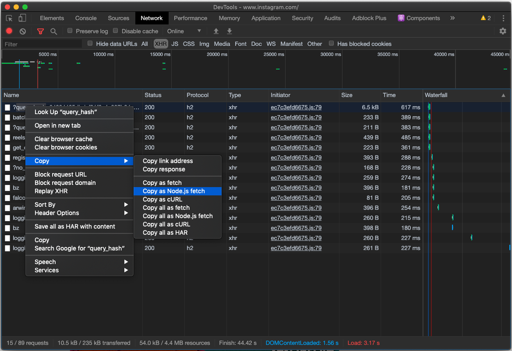
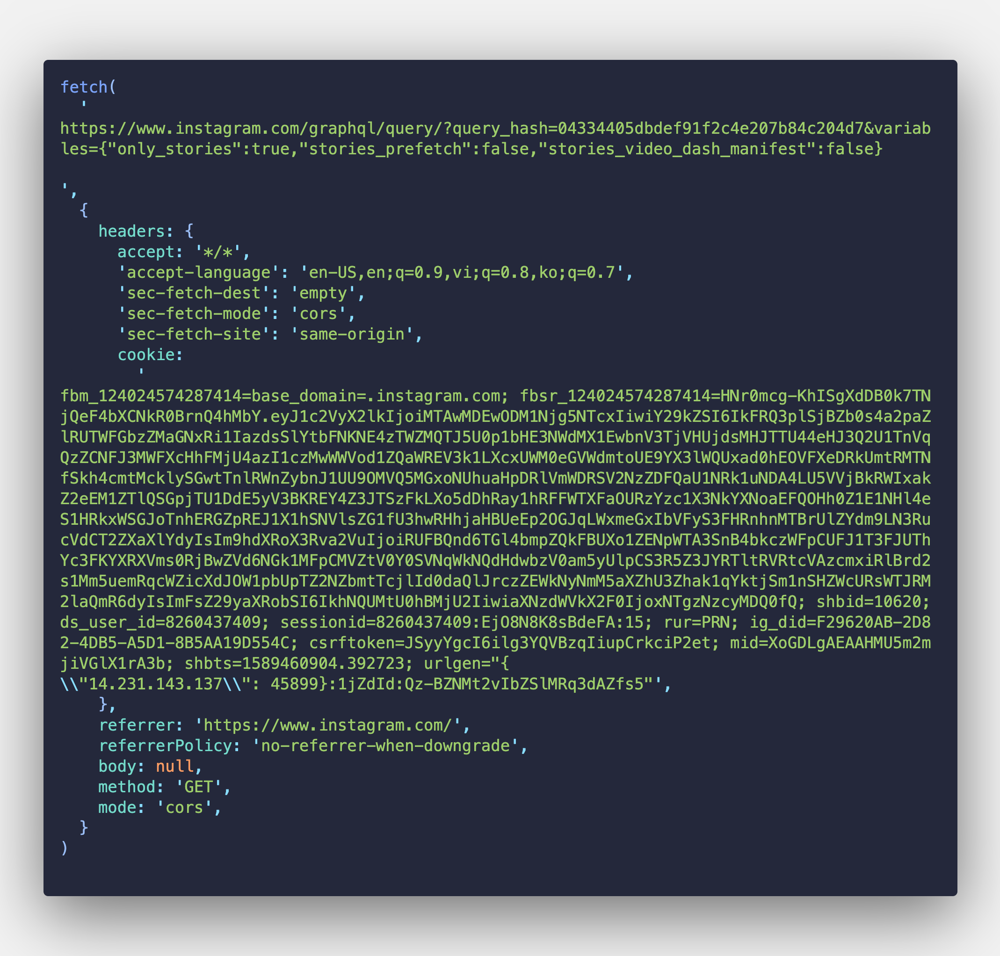
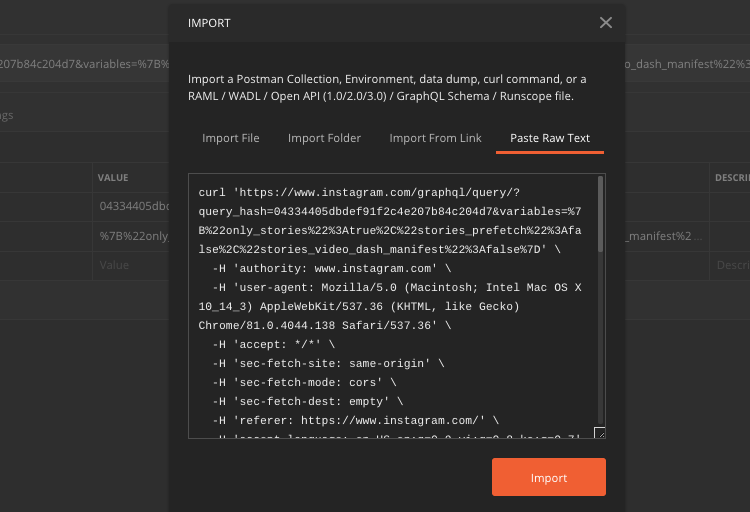

There're sometimes that you want to replay network request to do something like making some kind of tool, bot or testing
API

In Chrome DevTools > Network > Right click on Request

### Copy as Node.js fetch

After you copy, paste it in your favorite Editor/IDE. This will include cookie data

### Copy as cURL

You can either paste it in your terminal to replay the request

Or import to Postman by clicking File > Import > Paste Raw Text

